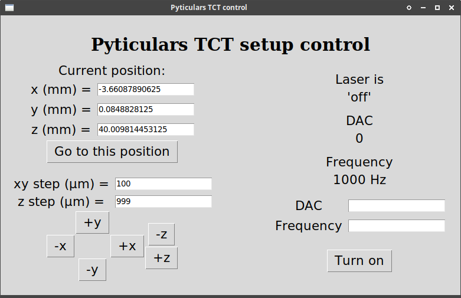

# PyticularsTCT

Package to control [Particulars TCT](http://particulars.si/) easily from Python.

## Installation

### Installation instructions for Linux

The following line
```
pip3 install git+https://github.com/SengerM/PyticularsTCT
```
should be enough.

After installing [PyUSB](https://github.com/pyusb/pyusb) you may get the common permission error `USBError: [Errno 13] Access denied (insufficient permissions)`. [This](https://stackoverflow.com/questions/50625363/usberror-errno-13-access-denied-insufficient-permissions/70436368#70436368) solved the problem for me.

### Installation instructions for Windows

1. First clone (or download) this repo in your favourite directory.
2. Run
```
pip3 install -e C:\wherever\you\cloned\this\repo
```
3. Install the file `vcredist_x64.exe` located in [`PyticularsTCT/PyticularsTCT/ximc/win64`](PyticularsTCT/ximc/win64). (You already downloaded it, just navigate within the repo to that file.)

Now it should work.

### Further installation instructions

This package depends on others which you will have to install (you will discover when you first try to use this one). Most of them are easy but some, such as [PyUSB](https://github.com/pyusb/pyusb), may be more tricky. However you should be able to make it work with help from Google.

This package was developed and tested only in our setup at UZH. It worked both on Linux (Ubuntu 20.04) and Windows (10).

## Usage

Usage example:
```Python
import PyticularsTCT
from PyticularsTCT.find_ximc_stages import map_coordinates_to_serial_ports
import time
import numpy as np

stages_coordinates = { # This dictionary maps the serial number of each stage to a coordinate. To know the serial numbers you can use the function find_ximc_serial_devices defined in the file find_ximc_stages.py.
	'00003A48': 'x',
	'00003A57': 'y',
	'000038CE': 'z',
}
ports_dict = map_coordinates_to_serial_ports(stages_coordinates) # You are not obliged to do this, you can just hardcode the serial ports in the line below. The advantage of this is that you don't need to change this each time the computer is restarted or the USB ports are disconnected.

tct = PyticularsTCT.TCT(x_stage_port=ports_dict['x'], y_stage_port=ports_dict['y'], z_stage_port=ports_dict['z'])

# Sweep laser intensity ---
tct.laser.on()
print(f'Laser is {tct.laser.status} at a frequency of {tct.laser.frequency} Hz.') # Should print 'Laser is on at a frequency of 1000 Hz'.
tct.laser.frequency = 2e3 # Change the frequency of the laser.
print(f'The frequency has been changed to {tct.laser.frequency} Hz.')
for DAC in np.linspace(0,1023,5):
	tct.laser.DAC = int(DAC) # Change the intensity of the laser.
	print(f'Laser DAC = {tct.laser.DAC}')
	time.sleep(1)

# Sweep position using the mechanical stages ---
current_position = tct.stages.position # Store current position to go back in the end.
print(f'Start position: {current_position}') # Should print something like 'Start position: (0.23912637, 0.07196379, 0.5165688)' where each value is x,y,z.
tct.laser.DAC = 0 # This is the most intense setting.
tct.stages.move_rel(z=-555e-6) # Move 555 µm in the "-z" direction.
for kz in range(11):
	tct.stages.move_rel(z=1111e-6/11) # Move in the "+z" direction.
	print(f'Current position is {tct.stages.position}')
	time.sleep(1)
print('Going back to start position...')
tct.stages.move_to(*current_position) # Go back to original position.
print(f'Current position is {tct.stages.position}')
print('Will turn off the laser now...')
tct.laser.off()
print(f'Laser status is {tct.laser.status}.')
print('Bye!')
```
Ideally you should use the `TCT` class defined in the [`__init__.py`](PyticularsTCT/__init__.py) file that abstracts the whole setup. This is a very simple class which has a `stages` artribute containing an instance of `TCTStages` defined in [`stage.py`](PyticularsTCT/stage.py) and an instance of `ParticularsLaserController` defined in [`ParticularsLaserController.py`](PyticularsTCT/ParticularsLaserController.py). The documentation is in the docstrings.

## More info

### About the motorized stages

The X,Y,Z stages in the setup are controlled by [8SMC5-USB - Stepper & DC Motor Controller](http://www.standa.lt/products/catalog/motorised_positioners?item=525) units. The programming interface is descripted [here](https://doc.xisupport.com/en/8smc5-usb/8SMCn-USB/Programming.html). *PyticularsTCT* is shipped with a hardcoded copy of the binaries for some operating systems together with a slightly modified version of the Python script that is provided by the original author of the *ximc library* (see [`PyticularsTCT/ximc`](PyticularsTCT/ximc)) in such a way that the control of the motors becomes easier. More information in the [`README.md`](PyticularsTCT/ximc/README.md) file located in [`PyticularsTCT/ximc`](PyticularsTCT/ximc).

If you want control only the motors as a standalone package here there is an example:
```Python
from PyticularsTCT.stage import TCTStages
from PyticularsTCT.find_ximc_stages import map_coordinates_to_serial_ports

stages_coordinates = { # This is what I have in the lab, in your case it may be different.
	'XIMC_XIMC_Motor_Controller_00003A48': 'x',
	'XIMC_XIMC_Motor_Controller_00003A57': 'y',
	'XIMC_XIMC_Motor_Controller_000038CE': 'z',
}
ports_dict = map_coordinates_to_serial_ports(stages_coordinates) # You are not obliged to do this, you can just hardcode the serial ports in the line below. The advantage of this is that you don't need to change this each time the computer is restarted or the USB ports are disconnected.
stages = TCTStages(x_stage_port=ports_dict['x'], y_stage_port=ports_dict['y'], z_stage_port=ports_dict['z'])

current_position = stages.position
print(f'Initial position: {current_position}') # Print (x,y,z) position.
stages.move_to(0,0,0) # Move to x=y=z=0.
print(stages.position)
stages.move_rel(z = 1e-2) # Move z 1 centimeter.
print(stages.position)
stages.move_rel(z = -.5e-2) # Move z -0.5 centimeter.
print(stages.position) # Position should be the initial position.
stages.move_rel(x = 1e-6, y = 2e-6) # Move 1 µm in x and 2 µm in y.
print(stages.position)
stages.move_to(*current_position) # Go back to previous position.
print(stages.position)

```
If, for some very weird reason, you want to control each of the motorized stages individually it is also possible, have a look at [the source code of `stage.py`](PyticularsTCT/stage.py).

### About the laser

The [PyticularsLaserController](PyticularsTCT/ParticularsLaserController.py) is a pure Python module. If you want to use this module individually, here there is an example:
```Python
from PyticularsTCT.ParticularsLaserController import ParticularsLaserController
from time import sleep

laser = ParticularsLaserController() # Open connection to laser.
laser.on() # This is equivalent to `laser.status = 'on'`.
print(f'Current laser status is: {laser.status}') # This should print "on".
for frequency in [50,100,1e3,10e3,100e3]:
	for DAC in [0,222,444,666,888,1023]:
		print(f'Setting f = {frequency} Hz, DAC = {DAC}...')
		laser.frequency = frequency # Change the frequency.
		laser.DAC = DAC # Change the DAC, from 0 to 1023.
		print(f'Current frequency = {laser.frequency} Hz') # This prints the current frequency.
		print(f'Current DAC = {laser.DAC}') # This prints the current DAC value.
		sleep(.5)
print('Will turn the laser off...')
laser.off() # This is equivalent to `laser.status = 'off'`.
print(f'Laser status is: {laser.status}')
```

## Graphical interface

A simple graphical interface is provided by *PyticularsTCT* to perform quick tests, laser alignment, etc. See the [`tct_graphic_interface.py`](gui/tct_graphic_interface.py) script. The graphical interface should be cross platform, though it has only been tested on Linux (Dec-2021).


